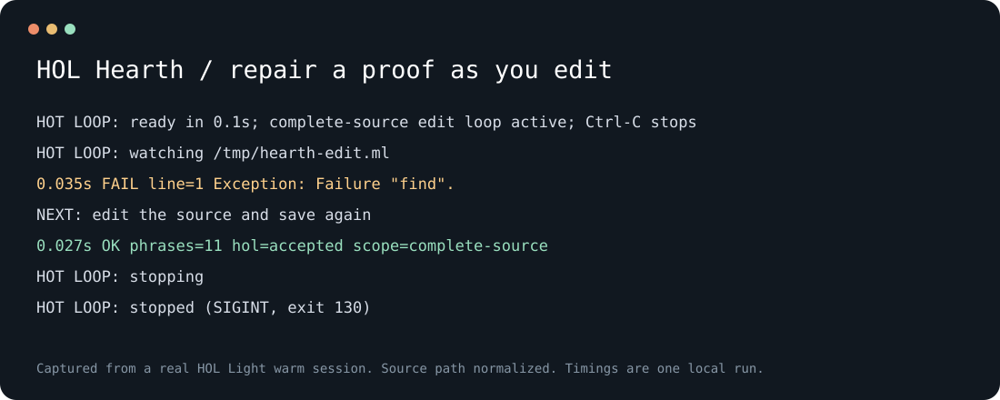

# HOL Hearth

**Keep HOL Light warm. Check every edit in a fresh process. Read a small receipt.**

HOL Hearth is a Linux command-line workspace for HOL Light proof authoring.
It reuses local CRIU snapshots, evaluates exact source bytes in disposable
children, and keeps the source hash, completion result and named theorem checks
together. A live mode checks each saved edit.

Run `./hearth setup` once to build a local `light` profile from pinned HOL
sources. Subsequent proof checks reuse it. A Linux kernel that supports CRIU
and permission to run CRIU are required; see [setup](docs/setup.md).



[Terminal recording](demos/live-loop.cast) · [Demo sources](demos)

## Try the tool

Linux and Python 3.11+ are enough to run the command and receipt checks:

```sh
git clone https://github.com/BenKnill/hol-hearth.git
cd hol-hearth
./hearth check
./hearth --help
```

No Python packages, virtual environment, Node, OPAM, or Dune are required for
these commands. The checks do not load HOL or create a snapshot.

## First proof on a fresh machine

On Debian or Ubuntu with Python 3.11+ and OCaml 4.14+ packages:

```sh
sudo apt-get update
sudo apt-get install --no-install-recommends python3 git make gcc ocaml-nox \
  ocaml-findlib camlp5 libzarith-ocaml-dev libcamlp-streams-ocaml-dev criu sudo
./hearth setup --check
./hearth setup
./hearth demo cat-map
```

If CRIU needs a sudo password, run `sudo -v` in the same shell before setup.
Setup prints progress and log paths while HOL loads. It builds only `light`,
keeps upstream sources and snapshots outside the clone, and preserves existing
runtime configurations. It never rebuilds an already compatible profile.

## Check a proof

On a machine with a compatible warm profile:

```sh
./hearth doctor
./hearth prove "$PWD/demos/cat-map.ml" --profile light --run-root "$PWD/runs/cat-map"
./hearth inspect "$PWD/runs/cat-map"
```

The cat-map demo proves a quadratic invariant and an inverse identity. The
balance demo proves conservation and nonnegativity of a transfer:

```sh
./hearth demo balance
./hearth demo failure
```

The failure demo intentionally omits the cross term in a squared sum. It only
reports an expected rejection when it receives a real HOL failure receipt.

## Edit in a loop

Build the small evaluator with the OCaml compiler used by your HOL profile:

```sh
./hearth build-native --ocamlc /ABS/hol-compiler/bin/ocamlc
cp demos/failure.ml /tmp/hearth-edit.ml
./hearth prove /tmp/hearth-edit.ml --profile light --loop
```

In another terminal, replace the source with `demos/repaired.ml`. Each save
gets a fresh HOL child. Stop the edit session with Ctrl-C. A shared warm broker
may remain for the next session.

## Requirements

| Operation | Dependencies |
| --- | --- |
| Help, profile listing, receipt reading, tool checks | Linux, Bash, Python 3.11+ standard library |
| First-time setup | Above, Git, Make, GCC, OCaml 4.14+, Findlib, Camlp5, Zarith, camlp-streams, CRIU |
| Recorded proof check | Above, local HOL Light runtime, CRIU and a compatible published profile |
| Live edit loop | Above, small evaluator compiled with the HOL runtime's OCaml compiler |
| Optional code linting | Ruff |
| Optional assembly profiles | Separately installed upstream source trees |

Linux is the platform boundary; the launcher does not whitelist distro names.
CRIU also depends on kernel features and appropriate privileges.
See [setup](docs/setup.md), [usage and evidence](docs/usage.md),
[validation](docs/validation.md), and [architecture](docs/architecture.md).

## License

[MIT](LICENSE). External tools keep their own licenses; see
[third-party dependencies](THIRD_PARTY.md). No upstream HOL sources, papers,
memory images or third-party binaries are bundled.

Public [profile recipes](profiles) are checked-in ML source; see
[how profiles are generated](docs/profiles.md) and the
[ML provenance review](docs/source-provenance.md).
