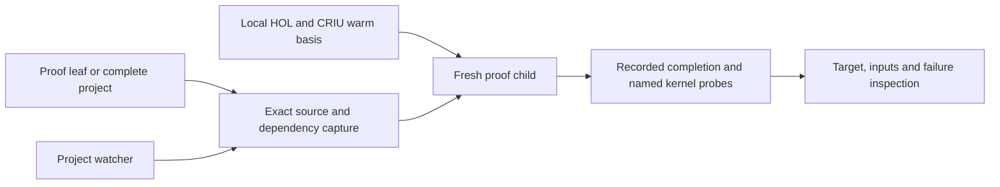

# How Hearth works

There is one proof execution path. Live editing schedules ordinary recorded
checks; it does not use a second OCaml evaluator with different loader/error
semantics. Each attempt is isolated in a disposable child of the warm basis.
The broker's actual capacity governs admission and queueing.

The Python standard-library command layer handles source capture, process
lifecycle, receipts and inspection. HOL remains the theorem authority.
Source completion, named binding checks and process transport are separate
observations. The watcher compares the captured dependency identity with
current inputs before labeling a result current.

Profile recipes describe a preloaded mathematical basis. Stable library loading
can be amortized across attempts. Arbitrary project prefix checkpointing,
automatic proof search/repair and final publication replay are outside the
ordinary authoring command.

Internal modules and receipt schema names retain hol_workbench for compatibility
with existing local profiles. The public command is hearth. There is no host
dispatcher, distro whitelist or separate native evaluator build.
The `cli/orbstack_criu_*` modules implement the Linux CRIU route, including
execution inside an OrbStack Linux machine; they are part of the public proof
path, not a native macOS evaluator.

## Acceptance and diagnostic boundaries

Review these modules when changing what a receipt can accept. Paths below are
relative to `hol-workbench/hol_workbench/`; this is an audit starting point, not
a claim that these modules alone form the trusted computing base. The selected
HOL runtime, its admitted profile and the operating environment remain trusted.

| Boundary | Modules | What the code establishes |
| --- | --- | --- |
| Captured inputs | [proofs/loader_scan.py](../hol-workbench/hol_workbench/proofs/loader_scan.py), [source_dependency_closure.py](../hol-workbench/hol_workbench/source_dependency_closure.py), [source_execution_plan.py](../hol-workbench/hol_workbench/source_execution_plan.py) | Bounded lexical dependency discovery, exact source and ELF hashes, and resolution against the selected project and HOL roots. The scanner is an edge-finder; HOL's parser executes the source. |
| Transported inputs | [source_dependency_package.py](../hol-workbench/hol_workbench/source_dependency_package.py), [source_load_transport.py](../hol-workbench/hol_workbench/source_load_transport.py) | Refuse unsupported or incomplete closures, recheck captured bytes while packaging, and route supported imports to their captured files. |
| Skipped warm imports | [profile_satisfied_dependencies.py](../hol-workbench/hol_workbench/profile_satisfied_dependencies.py) | Compare captured warm sources and descendants against the admitted inventory before allowing `needs` to skip execution. Changed inputs yield `refused_profile_satisfaction_dependency_changed`. |
| Fresh-child execution and receipts | [cli/orbstack_criu_vanilla.py](../hol-workbench/hol_workbench/cli/orbstack_criu_vanilla.py), [proof_run_fork_broker.py](../hol-workbench/hol_workbench/proof_run_fork_broker.py), [proof_run_fork_phrase.py](../hol-workbench/hol_workbench/proof_run_fork_phrase.py), [cli/orbstack_criu_vanilla_artifacts.py](../hol-workbench/hol_workbench/cli/orbstack_criu_vanilla_artifacts.py) | Pin entrypoint bytes, execute the packaged payload in a disposable child, distinguish transport outcomes, and persist the observed result and identities. |
| Source completion and named claims | [proofs/theorem_scan.py](../hol-workbench/hol_workbench/proofs/theorem_scan.py), [vanilla_claims.py](../hol-workbench/hol_workbench/vanilla_claims.py), [cli/orbstack_criu_vanilla_semantics.py](../hol-workbench/hol_workbench/cli/orbstack_criu_vanilla_semantics.py) | Discover probe targets, append and account exact nonce-bound probes, and require completed transport, a unique completion marker and no included-file errors. A printed theorem value alone is not acceptance. |
| Reused project basis | [project_basis.py](../hol-workbench/hol_workbench/project_basis.py), [foundation_delta.py](../hol-workbench/hol_workbench/foundation_delta.py) | Bind reuse to source, dependencies, objects, profile, backend and live process identity. Admission requires a successful preparation receipt, verified raw transcript and observed zero axiom delta. |

Literal theorem probes compare the kernel conclusion with the source quotation
and require empty hypotheses. Nonliteral statements receive only binding and
`thm`-type checks; the receipt names that weaker verification kind. Neither
complete OCaml execution nor an unfinished interactive goal proves an intended
target that was not checked.

Foundation deltas are advisory in ordinary replay: zero new axioms describes
growth from the admitted basis, not an independent audit of that basis.
Project-basis admission makes the zero-delta observation a requirement.

[proof_diagnostics.py](../hol-workbench/hol_workbench/proof_diagnostics.py)
attributes failures and running bindings for feedback.
[filter_output_events.py](../hol-workbench/hol_workbench/filter_output_events.py)
recognizes printed binding names. These observations do
not replace the nonce-bound acceptance accounting above. Inspection and watch
freshness remain important reporting boundaries: they must present the recorded
scope and mark changed inputs unchecked, rather than promote progress text or
an older receipt into a current proof result.
