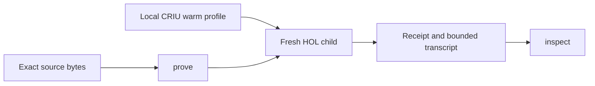

# How Hearth works

The orchestration layer is Python standard library code. CRIU is a separate
executable. HOL Light remains the proof authority. The live evaluator uses
OCaml's installed toplevel parser, including HOL syntax, instead of replacing
it with a text parser.

A warm broker owns the loaded basis. Each proof runs in a fresh child.
Source packaging preserves dependency identity. Receipt handling keeps
transport failure, source completion and theorem binding checks separate.

Internal Python modules and receipt schemas retain the `hol_workbench`
namespace for compatibility with existing profiles. The public command is
`hearth`. There is no macOS dispatcher or distro-name check in its launcher.

The source includes internal snapshot and lifecycle code used by the
authoring path. Provisioning and independent publication machinery are
maintainer concerns and are not ordinary proof commands.
