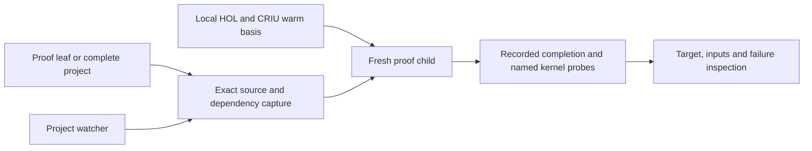

# How Hearth works

There is one proof execution path. Live editing schedules ordinary recorded
checks; it does not use a second OCaml evaluator with different loader/error
semantics. Each attempt is isolated in a disposable child of the warm basis.
The broker's actual capacity governs admission and queueing.

The Python standard-library command layer handles source capture, process
lifecycle, receipts and inspection. HOL remains the theorem authority.
Source completion, named binding checks and process transport are separate
observations. The watcher compares the captured dependency identity with
current inputs before labeling a result current.

Profile recipes describe a preloaded mathematical basis. Stable library loading
can be amortized across attempts. Arbitrary project prefix checkpointing,
automatic proof search/repair and final publication replay are outside the
ordinary authoring command.

Internal modules and receipt schema names retain hol_workbench for compatibility
with existing local profiles. The public command is hearth. There is no host
dispatcher, distro whitelist or separate native evaluator build.
